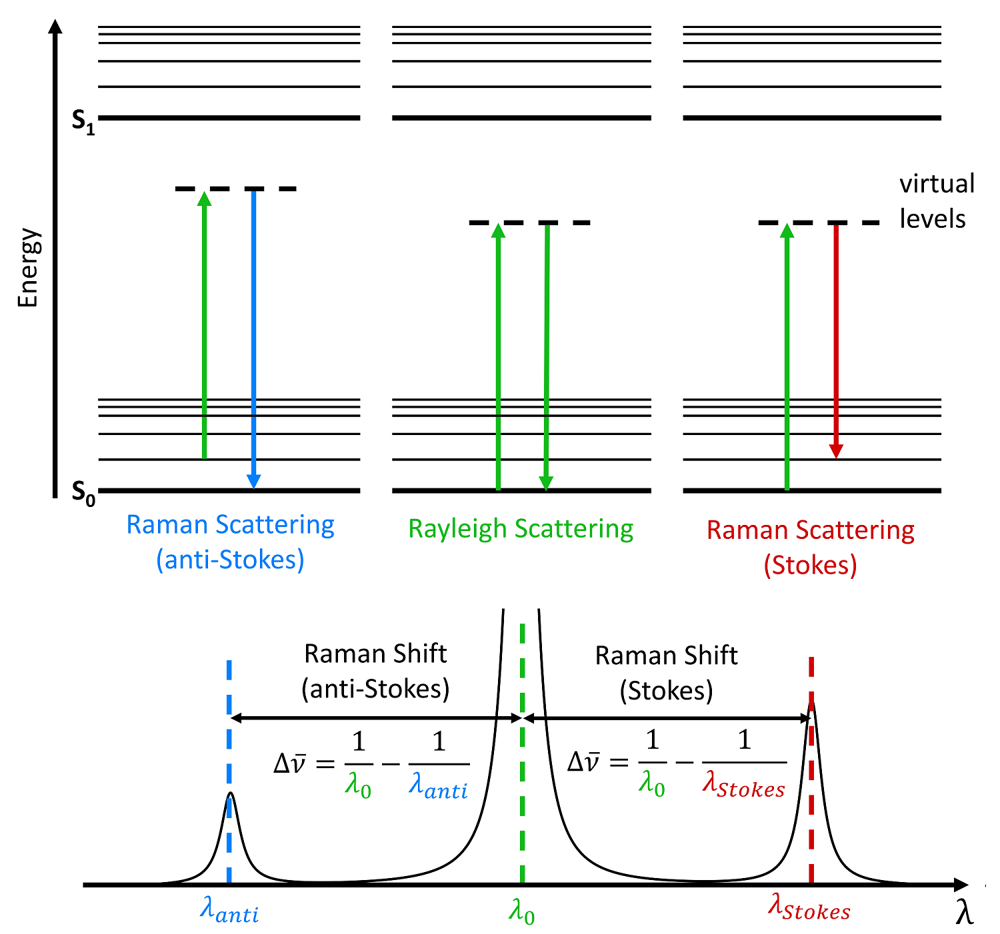

### Background on Raman spectroscopy
Raman  spectroscopy  is  a  technique  that  has  previously  been used  in  identifying  chemical  compounds  and  is  now  being explored in molecular biology as a way of classifying cells by their  cell-type  or  cell-state.  In this experiment, Raman spectra are taken at a pixel-level, measuring changes in photon wavelength after scattering inelastically with a substance. A large collection of energy-shifted photos can be collected within each pixel to create a plot, representing a fluorescent fingerprint related to its content.

Because  Raman  spectra taken  at  a  single-cell  level  have  been  useful  for  identifying cell-type,   it’s   natural   to   assume   they   may   also   be   used to  segment  an  image,  differentiating  the  foreground  from the  background.  It’s  important  to  note  that  spatial  Ramanspectroscopy   contains   entirely   different   information   than does  a  spatial  image.  While  an  image  may  be  considered  an order  three  tensor  containing  three  channels  (RGB),  spatialRaman  spectroscopy  is  an  order  three  tensor  containing,  in this  experiment,  1,340  features  for  each  pixel.  These  feature represent  discrete  levels  of  energy  shifts  of  photons  that undergo   inelastic   collisions,  or   Raman   scattering.   Being able  to  segment  cells  with  spatial  Raman  spectra  would  bemonumental to the field of computer vision. 

Photo reference: [Edinburgh Instruments] (https://www.edinst.com/blog/what-is-raman-spectroscopy/)
