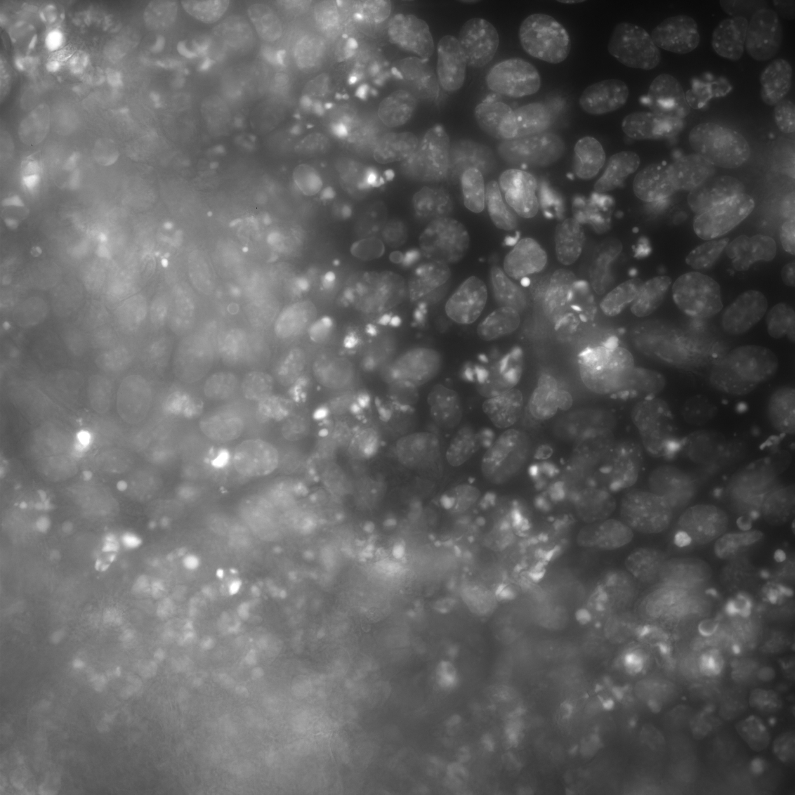

### Dataset

The dataset used in the project was generated in MIT's Raman Microscopy lab. Over the course of seven days, mouse fibroblast cells undergoing cellular reprogramming were imaged in multiple ways. This project was most concerned with spatial Raman spectral imaging in which a Raman spectra of dimensions 1340 was taken from each pixel in images of dimensions 100 x 100.   Raman tensors were then created of dimension (100, 100, 1340), one for each time point (taken ever 12 hours). 

Standard microscopic images were also taken of the cells after their nuclei had been stained for easier visualization. To get the ground-truth labels, we used a nuclei image-segmentation algorithm named [NucleAIzer] (http://www.nucleaizer.org/) developed by a colleague at the Broad Institute to get the foreground labels. Another collaborator hand-segmented a portion of the images to get background labels. Only Raman spectra corresponding to pixels that were confidently classified as foreground using NucleAIzer or background by hand-selection were used to create the training, validation, and testing sets. 

### Data Preparation

1)  Data  Preprocessing: All  spectra  were  pre-processed by  first  extracting  the  ”fingerprint  region”  (indices  410:1340 of  each  spectrum),  removing  cosmic  rays  using  a  recursive version of the [Whitaker Haye’s algorithm] ("https://chemrxiv.org/articles/A_Simple_Algorithm_for_Despiking_Raman_Spectra/5993011/2?file=10761493") that I developed, removing  auto-fluorescence  using  [Rampy’s] (https://github.com/charlesll/rampy)  alternative-leastsquares   method,   subtracting   a   horizontal   mean   and standard  scaling  to  zero  mean  and  unit  variance  for  each feature (a quantity known as the wavenumber)

2)  Class  Balancing : Upsampling  was  done  by  sampling background spectra, the minority class, with replacement until the  number  of  background  spectra  matched  the  number  of foreground spectra in the training, testing, and validation sets.  Downsampling  was  done  by  random  selecting  foreground spectra,  the  majority  class,  without  replacement  until  the classes  were  balanced.  Sklearn’s  resampling  function  was used for both of these class balancing methods
