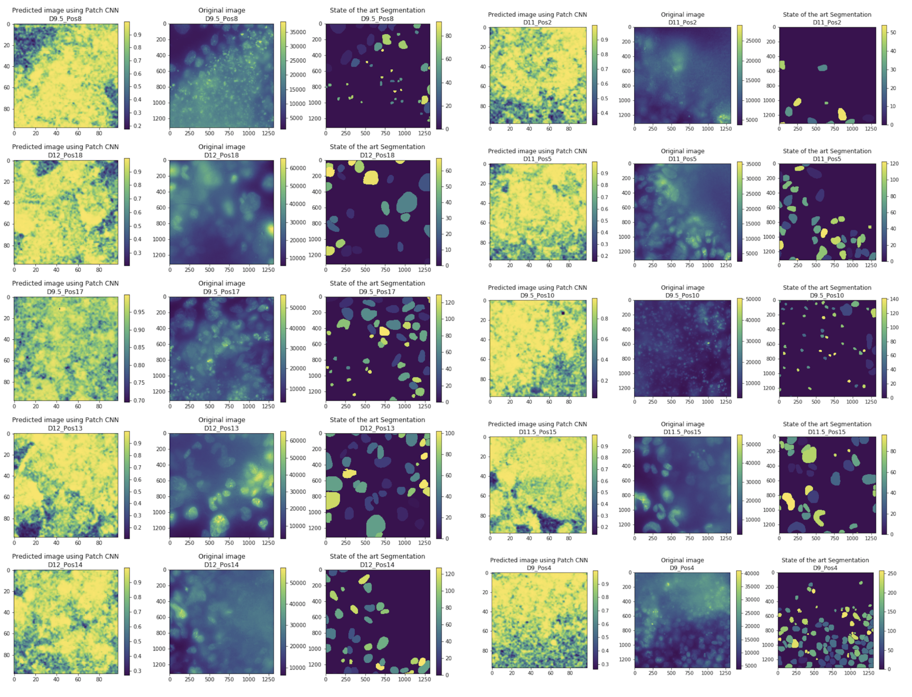
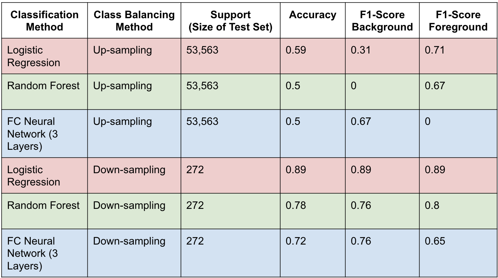
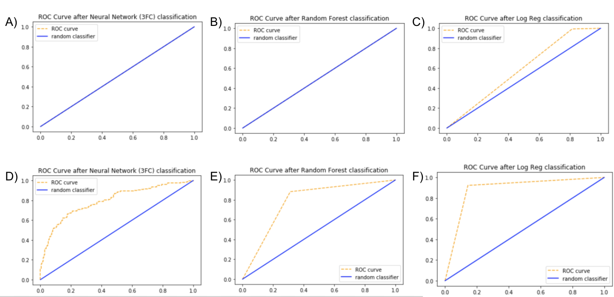
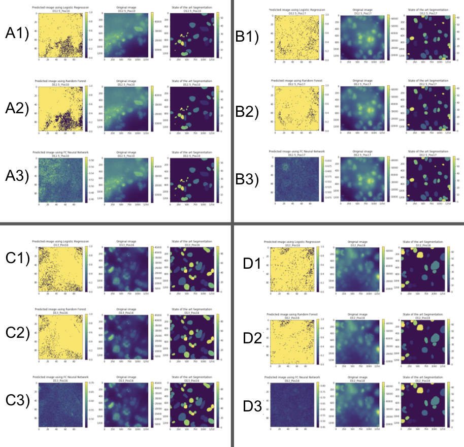
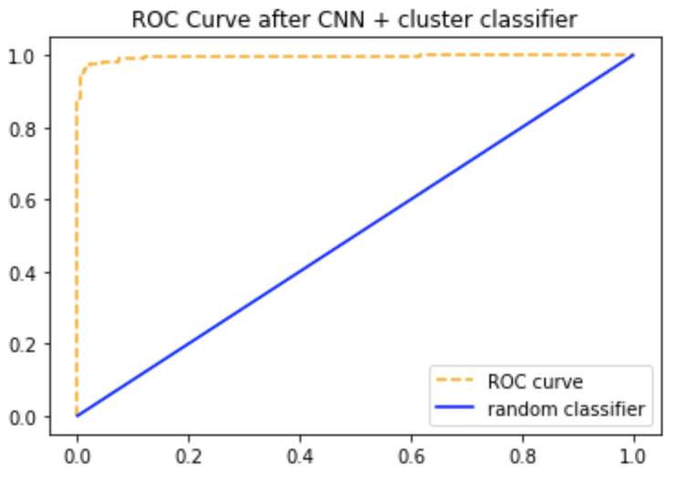

### Overview
Raman spectroscopy has been shown to be a non-destructive, label-free method for determining molecular composition.  A Raman spectra can be taken of each pixel in a microscopic image, representing a high-dimensional spatial tensor that may be useful in extracting meaningful biological signal.  In this project, I will explore the use of Spatial Raman spectra in segmenting images of nuclei, distinguishing individual cells from their backgrounds. I compare several pre-processing methods and standard classifiers in distinguishing foreground from background as well as map foreground probability predictions to a 2D image, generating a segmentation map. Additionally, I will create and test a convolutional neural network based on Raman tensor patches for image segmentation.

### Motivation
Image  segmentation  is  a  common  problem  in  Computer Vision  with  widespread  applications.  In  the  field  of  biology, segmentation  has  already  been  used  to  segment  images  of entire  cells  as  well  as  cellular  sub-components  (e.g.  nuclei).  The quality of a segmentation algorithm, however, is highly  dependant  on  the  quality  of  the  images  in  the  dataset,  preventing  most  neural-network  based  segmentation methods from identifying and segmenting objects better thanthe  human  eye.  Images  that contain a large amount of noise may mask objects, preventing the  object  from  being  detected  or  segmented.  In  the  case  of segmenting  images  of  nuclei,  there  may  be  a  high  amountof  auto-fluorescence  from  the  microscope  used  to  gather  the image,  creating  noise  that  can  mask  cells,  preventing  them from being detected. For  this  project,  I  will  investigate  the  potential  use  of spatial  Raman  spectroscopy to overcome the problem of low-quality images.

### Results
One main challenge in distinguishing foreground from foreground comes from a large imbalance between the two classes -- there are far greater cell labels than background labels. This is true because the "ground truth" cell labels were generated using a state-of-the art image segmentation method. However, the background spectra were entirely created by hand by one of my collaborators. Due to the labor intensity of generating more background spectra by hand, I explored using Down-sampling and Up-sampling as methods to balance the two classes prior to classifying raman spectra as foreground or background. 

The table above shows accuracies and f1-scores of three different classification methods using two different times of class balancing -- either Up-sampling or Down-sampling. Each of the classifiers perform very poorly on the dataset balanced through up-sampling, performing at or slightly better than a classifier that assigns labels randomly. In stark contrast, the classifiers trained on the dataset balanced through down-sampling perform significantly better, all with accuracies above 70\%. 

#### None of the three basic models can segment the test spatial raman spectra near the same level as a state-of-the art model
Following class-balancing, three basic methods were used to predict whether a Raman spectra in a given spatial pixel belonged to a nuclei or background. Logistic Regression, Random Forests, and a basic shallow Neural Net were used to classify spectra. From the figures above, we see that Logistic Regression largely out-performed Random Forests and Neural Networks, suggesting that the difference between foreground and background may be captured linearly. 

Despite the dominance of Logistic Regression, none of the three models were able to segment any image with the same quality as the state-of-the-art model. Further thinking was needed to improve performance. 

#### CNN based on tensor patches is superior to basic Models but does not rival state-of-the-art method} 
A Convolutional Neural Network that takes into account each Raman spectra's neighbors  was then used. This model far out-performed either of the three basic models, yielding the ROC curves above and a test accuracy of 97.6 \%. \\

The trained model was also used to generate segmentations of entire images that were not found in either the train or validation sets.  The first figure on this page shows the performance of this model on 10 randomly-selected images, as compared with an image taken of the same spatial location and the state-of-the-art segmentation method. This model much more effectively captured nuclei and background than three basic models and even rivals the state-of-the-art segmentation method on some of the images.

### Discussion and Summary
In this project, I have shown that down-sampling the majority class (foreground) prior to classification leads to better performance than up-sampling the minority class (background). I compare several standard classifiers in differentiating foreground from background, showing that Logistic Regression performs better than Random Forests and a Dense 3-Layer Neural Networks in classifying foreground and predicting segmentation masks. I create and show the use of an image patch-based CNN in segmenting, providing great evidence of its superiority in classifying foreground from background and in generating sensible segmentations.  

While this model can surely be improved in predicting segmentation masks, this work shows a promising result in segmenting images using only spatial raman tensors instead of images, which may be more informative and better able to capture information than standard nuclei-stained images.  With more time, and perhaps in a future work, I would spend more time hand-labeling background spectra to better balance the foreground and background classes.  This would presumably lead to performance even better than using up-sampling or down-sampling.  It would also provide more data, which nearly always improves a neural net's ability to perform prediction tasks. 

For future work, I would suggest iterating on the patch-based CNN to better segment images. It may also be desirable to know which features are most important for classifying spectra as foreground or background; applying an interpret-ability method such as Integrated Gradients, Saliency Maps, or Sufficient Input Subsets could help in a deep learning context like this. Lastly, I would propose exploring unsupervised methods for cell-segmentation using spatial Raman tensors in the event labels cannot be effectively acquired.
